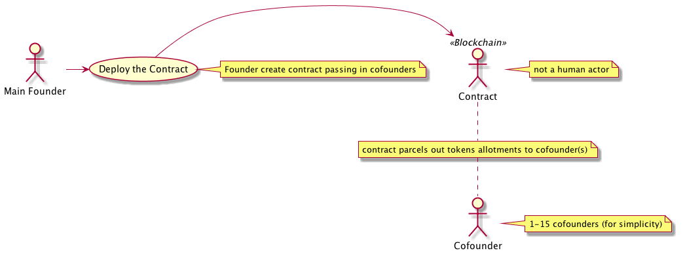

# gin-contracts

## Cofounder Deployment Use Case

1. Cofounder deploys contract
    - passing in cofounder addresses (capped at 15 for code clarity, and to limit gas utilization upon deployment)
2. Contract parses cofounder list (an array of addresses)
    - adds cofounder's addresses to internal list of cofounders
3. Contract assigns allotment of tokens to cofounders

---
(Diagrams created using [plantuml](http://plantuml.com/)

